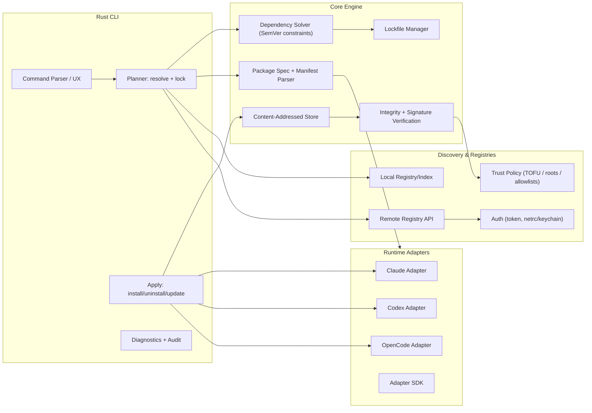

# Cross‑Agent Plugin Manager and Team‑Sync System Design for a Rust CLI

## Executive summary

This proposal defines a **cross‑agent plugin manager**—a Rust CLI inspired by Cargo—that installs, versions, validates, and synchronizes **skills**, **rules**, **agents**, and related assets across heterogeneous agent runtimes (examples: `.claude`, `.codex`, `.opencode`). The core idea is to treat “agent customization” as a **portable package** with (a) a *unified manifest*, (b) a *deterministic lockfile*, and (c) *runtime adapters* that materialize the package into each runtime’s native on-disk format and configuration conventions.

The design intentionally aligns with proven package-manager patterns: declarative manifests + lockfiles for reproducibility (as in Cargo’s `Cargo.toml` vs `Cargo.lock`) citeturn4search7turn14search10, and registry-based distribution + integrity verification (as in SwiftPM registries with checksum TOFU and optional signing) citeturn3view2turn6search26. For agent ecosystems specifically, the proposal uses the **Agent Skills** open standard as the canonical “skill payload” format (directory + `SKILL.md` with YAML frontmatter) citeturn18search1turn20view0 and maps it to each runtime’s conventions (e.g., Claude skills locations and plugin skill namespacing) citeturn20view0turn20view2 and Codex “skills” and Team Config layering citeturn17view2turn17view3.

The MVP deliberately focuses on what teams need to evaluate quickly:

- A **local package format** + **installer** that can *emit* `.claude/skills`, `.codex/skills`, and `.opencode` equivalents in a project repo.
- A **lockfile** that makes sync deterministic in dev + CI (Cargo-style `--locked` and offline workflows) citeturn14search1turn14search10.
- A **minimal registry protocol** (HTTP + signed index optional) with “trust on first use” (TOFU) as the baseline (SwiftPM’s checksum TOFU pattern is a strong precedent) citeturn3view2turn6search26.

Everything else (full remote registry UX, rich marketplace browsing, keyless signing, policy engines, telemetry pipelines) fits incrementally into v1/v2.

## Context, goals, non‑goals, and target workflows

### Problem framing

Agent runtimes are converging on similar primitives—**skills**, **rules/instructions**, **agents/subagents**, **hooks**, **MCP servers**, and **plugins**—but they differ in:

- File locations and scoping semantics (user vs project vs managed policies). Claude Code explicitly supports user/project/local/managed scopes for settings and plugins citeturn11search2turn8view4; Codex introduced **Team Config** layers across `.codex/` folders plus user/system locations citeturn17view2turn17view3.
- Packaging and install mechanics: Claude Code plugins are directories with `.claude-plugin/plugin.json` and components at the plugin root; marketplace installs are cached under `~/.claude/plugins/cache`, with path traversal restrictions citeturn13view0turn9view0. OpenCode plugins can be local JS/TS files or npm packages installed automatically via Bun and cached in `~/.cache/opencode/node_modules/` citeturn12view0.
- Rule formats: Codex command rules live under `rules/` in Team Config locations and are scanned at startup citeturn16search1. OpenCode rules are centered on an `AGENTS.md` file (and can also pull in multiple instruction files via config) citeturn11search1turn11search3.

This fragmentation creates pain for developers and teams: duplicated content, inconsistent versions, non-reproducible CI, unclear trust boundaries when installing third‑party extensions.

### Goals

- **Unified packaging:** One package can carry skills (Agent Skills standard), agents, rules, and optional runtime-specific overlays, then be installed into multiple runtimes via adapters.
- **Deterministic team sync:** A lockfile pins exact versions and sources so that teammates and CI get the same effective configuration (Cargo’s lockfile intent is deterministic builds) citeturn4search7turn4search16.
- **Multi-scope installs:** Support user vs project vs local installs modeled on established agent runtimes (Claude Code plugin scopes and settings hierarchy) citeturn11search2turn8view4.
- **Security by default:** Integrity verification and provenance-aware practices (at minimum checksum verification / TOFU; optional signing and transparency logs).
- **Extensible adapters:** New runtimes can be integrated without changing the package spec.

### Non‑goals

- Build a full IDE extension ecosystem or replace runtime marketplaces.
- Execute arbitrary third‑party code by default; the manager’s core should treat scripts as *declared capabilities*, with explicit enablement and sandboxing.
- Create a new skill format: the package should *embed* Agent Skills as the canonical unit citeturn18search1turn20view0.

### Target users and workflows

**Single developer (local-first):**
- Create a package from existing `.claude/skills` or `AGENTS.md`.
- Install into one runtime quickly (e.g., “make my repo usable in Claude Code and Codex”).

**Team sync (repo-based standards):**
- Include a project-scoped install output in version control (similar to Claude’s `.claude/settings.json` for team-shared settings) citeturn11search2.
- Use a lockfile so every developer gets consistent versions.

**CI (deterministic + offline-friendly):**
- Validate package integrity and compatibility without network access, analogous to Cargo’s offline/frozen patterns (offline avoids network; `--frozen` implies `--locked` + `--offline`) citeturn14search1turn14search10.
- Export runtime artifacts into the repo/workspace before running agent tasks.

## Architecture overview with components and data flows

### Component model

At a high level, the manager has three layers:

- **Core:** package parsing, dependency resolution, lockfile, store, integrity verification.
- **Adapters:** runtime-specific “emitters” and “importers” (e.g., Claude, Codex, OpenCode).
- **Distribution:** registry clients, authentication, signing verification, and trust policies.



### Install and team-sync data flow

This emphasizes: resolve → lock → fetch → verify → materialize.

```mermaid
sequenceDiagram
  participant Dev as Developer/CI
  participant CLI as Manager CLI
  participant Reg as Registry (optional)
  participant Store as Local Store
  participant Adapt as Runtime Adapter
  participant Repo as Working Repo (.claude/.codex/.opencode)

  Dev->>CLI: install pkg@constraint --scope project
  CLI->>CLI: resolve constraints -> concrete versions
  CLI->>CLI: write lockfile (deterministic pins)
  CLI->>Reg: fetch artifacts + metadata (if remote)
  Reg-->>CLI: package tarball + checksums (+ signatures)
  CLI->>Store: cache artifact by digest
  CLI->>CLI: verify checksums/signatures per trust policy
  CLI->>Adapt: emit runtime-specific outputs
  Adapt-->>Repo: write .claude/..., .codex/..., .opencode/...
  Dev->>CLI: sync (on teammate machine or CI)
  CLI->>CLI: read lockfile; fetch exact artifacts
  CLI->>CLI: verify; re-emit outputs
```

This approach mirrors why lockfiles exist: to record an exact resolved state for deterministic reproduction citeturn4search16turn4search7.

## Unified plugin package specification

### Package identity and semantic versioning policy

**Versioning policy:** adopt Semantic Versioning 2.0.0 as the normative scheme citeturn21search0.

- **MAJOR**: breaking changes to the package’s public interface (especially runtime outputs or declared capabilities).
- **MINOR**: backward-compatible additions.
- **PATCH**: backward-compatible fixes (including metadata-only fixes, unless they change emitted outputs).

Where “public interface” must be precisely defined for agent packages: it includes **skill names**, **agent names**, **exported runtime artifacts**, and **permissions/capabilities**.

### Why Agent Skills should be the canonical skill payload

The Agent Skills specification standardizes “skill as folder with `SKILL.md` and optional supporting files” citeturn18search1turn18search5. Claude Code explicitly states its skills “follow the Agent Skills open standard” and adds extensions for invocation control and subagents citeturn20view0. Codex describes skills as directories with `SKILL.md` and uses progressive disclosure by starting from metadata, loading full instructions when used citeturn18search9. This convergence makes Agent Skills the best common denominator.

### Proposed unified package: “agentpack”

A package is a directory (or tarball) containing:

- **Manifest** (YAML or JSON): `agentpack.yaml` (authoritative for the manager).
- **Skills**: `/skills/<name>/SKILL.md` (Agent Skills format).
- **Agents**: `/agents/<name>.md` (portable agent personas/prompts + tool policy).
- **Rules**: `/rules/` containing one or more source formats; adapters translate these into runtime-native formats (e.g., Codex `.rules` files or OpenCode `AGENTS.md`).
- **Runtime overlays**: `/adapters/<runtime>/...` for precise mapping customizations, when generic conversion is insufficient.
- **Optional scripts/resources**: templates, references, assets.

This is intentionally compatible with Claude plugin layouts (plugin root contains `skills/`, `agents/`, plus `.claude-plugin/plugin.json` if you are packaging specifically for Claude) citeturn20view2turn8view3, but does not require Claude plugin semantics.

### Manifest fields

Below is a recommended manifest schema. The manager should support both YAML and JSON, but store canonical form internally.

#### Example manifest (YAML)

```yaml
apiVersion: agentpack/v0
name: acme-dev-standards
version: 1.2.0
description: Shared skills, agents, and rules for Acme engineering teams.
license: Apache-2.0

authors:
  - name: Acme Platform Team
repository:
  type: git
  url: https://example.com/acme/agentpacks/dev-standards
homepage: https://example.com/dev-standards

# What this package provides in a runtime-neutral way
exports:
  skills:
    - path: skills/code-review
      id: code-review
    - path: skills/incident-triage
      id: incident-triage
  agents:
    - path: agents/security-reviewer.md
      id: security-reviewer
  rules:
    - id: safe-shell
      sources:
        - type: codex.ruleset
          path: rules/codex/default.rules
        - type: opencode.agents_md
          path: rules/opencode/AGENTS.md

# Capabilities required by included scripts/hooks
capabilities:
  - id: shell.exec
    sensitivity: high
    justification: Needed to run repo-local linters and tests.
  - id: fs.write
    sensitivity: high
    justification: Some skills create patches; require explicit approval.

# Dependency model
dependencies:
  agentpacks:
    core-security:
      requirement: "^2.0.0"
      registry: "acme-registry"

# Compatibility constraints per runtime (fail-fast)
compatibility:
  runtimes:
    claude:
      minVersion: "1.0.33"
    codex:
      minVersion: "0.6.0"
    opencode:
      minVersion: "0.11.0"

# Runtime adapters control how to emit artifacts
adapters:
  claude:
    mode: plugin   # plugin | standalone
    pluginName: acme-dev-standards
  codex:
    teamConfigLayer: project
    emitRules: true
    emitSkills: true
  opencode:
    emitInstructions: true
    instructionsMode: "AGENTS.md"
```

#### Required and recommended fields

- `apiVersion`, `name`, `version`: required. Claude plugin manifests require `name` if present citeturn8view2; this design makes identity mandatory to ensure stable registry addressing.
- `exports`: required to make the package graph explicit and avoid “magic file discovery”.
- `compatibility`: recommended to fail early instead of emitting incompatible outputs.

### File layout and metadata conventions

The package should embed Agent Skills folders as-is:

- `skills/<skill-name>/SKILL.md` must have frontmatter with at least `name` and `description` for strict Agent Skills compliance citeturn18search1turn18search5.
- Claude Code’s skill UX emphasizes where skills live (enterprise/personal/project/plugin) citeturn20view0; the manager should treat those locations as **installation targets**.

### Dependency and version resolution

#### Design target

Support Cargo/SwiftPM-like dependency constraints, resolved into a lockfile. Cargo’s `Cargo.lock` captures exact versions and is intended for deterministic builds citeturn4search7turn4search16; SwiftPM’s `Package.resolved` plays an analogous role and Swift evolution proposals formalized it as the always-created resolution state citeturn6search21.

#### Recommended solver strategy

Use a PubGrub-style solver (Rust has a mature `pubgrub` crate describing version-solving behavior and conflict explanations) citeturn6search24. This is especially valuable because cross-agent packages will frequently face compatibility conflicts (runtime min/max versions, capability constraints, policy restrictions).

### Compatibility matrix

The manager should maintain a computed compatibility matrix:

- Package declares runtime constraints (`compatibility.runtimes.*.minVersion`).
- Adapter declares supported runtime output features.
- Manager computes whether current installed runtime versions meet constraints.

For Codex and Claude, “version” may often be available via runtime CLI; where not available, fall back to best-effort.

## Registry and discovery model

### Design alternatives and recommendation

| Registry model | What it looks like | Pros | Cons | Recommended use |
|---|---|---|---|---|
| Git index (Cargo-like) | An index repo mapping package → versions → checksums; artifacts fetched separately | Simple, auditable history; fits existing git workflows; supports mirroring/vendor strategies like Cargo “source replacement” citeturn14search3turn14search7 | Git scaling issues at high volume; needs careful consistency guarantees | Strong for internal enterprise registries; good MVP baseline |
| HTTP registry (SwiftPM-like) | API implementing registry endpoints; clients fetch versions, manifests, archives; checksum verification is mandatory in Swift registry spec citeturn6search26 | Efficient; supports auth and signing; SwiftPM supports checksum TOFU and package signing validations citeturn3view2turn6search26 | More server complexity; requires availability and API versioning discipline | Best long-term public registry model |
| “Just Git repos” (SwiftPM classic) | Resolve by git tags and manifest in repo | Zero infrastructure | Non-reproducible archives; tags can be moved; slower; weaker supply-chain posture | Useful as fallback/source type, not as the main registry |

**Recommendation:** Implement **Git-index + HTTP artifact fetch** in MVP (Cargo-like), then add **HTTP registry APIs** (SwiftPM-like) in v1. The manager should always treat **git repo sources** as a fallback origin type for bootstrapping and internal prototyping.

### Authentication and credential storage

SwiftPM registry docs demonstrate interactive login and storing credentials in OS credential store or `~/.netrc` as fallback citeturn3view2. Claude and Codex also use OS keychains for sensitive tokens in some paths (Codex mentions keychain/keyring for auth storage) citeturn17view3.

**Recommendation:** support:
- `--token` or `login` command storing in system keyring when available.
- `~/.netrc` fallback (explicit flag, user acknowledgement).

### Signing, integrity, and trust

#### Baseline: checksums + TOFU

SwiftPM registry usage provides a concrete, implementable pattern: checksum trust-on-first-use and stored fingerprints; mismatches fail by default, with an option to warn instead of error citeturn3view2. This is an excellent baseline.

#### Optional: signing

SwiftPM registry support includes verifying signatures and certificate chains, plus configurable behaviors for unsigned packages and untrusted certificates citeturn3view2.

For your manager, there are three escalating trust models:

1. **Ed25519 key signing** (simple, fast, offline-friendly).
2. **Sigstore keyless signing (cosign)**: keyless signing binds ephemeral keys to OIDC identities via Fulcio and records signing events in Rekor (transparency log) citeturn21search2turn21search10.
3. **TUF-style repository security**: TUF defines roles (Root/Targets/Snapshot/Timestamp) to defend against mix-and-match and rollback attacks citeturn21search1turn21search5.

**Recommendation:** MVP implements checksums + TOFU. v1 adds signature verification (start with Ed25519 keys you control). v2 adds Sigstore integration for public ecosystem scaling and/or TUF metadata for high-assurance registries.

### Trust policy configuration

Codex’s managed configuration shows an important enterprise precedent: admins can enforce constraints via `requirements.toml`, and it includes allowlisting MCP servers and restrictive command rules citeturn17view1turn17view0. Claude Code also supports managed settings that cannot be overridden citeturn11search2.

Your manager should support a similar concept: immutable “org policy” layers (e.g., `/etc/agentpack/policy.toml`) that can forbid:
- unsigned packages,
- unknown registries,
- packages requiring high-sensitivity capabilities.

## Installation semantics, CLI UX, and runtime adapters

### CLI principles

Model the UX after Cargo and SwiftPM:

- Explicit verbs: `install`, `remove`, `update`, `fetch`, `publish`.
- Determinism flags: `--locked`, `--offline`, `--frozen` consistent with Cargo semantics citeturn14search1turn14search10.
- Machine-readable output option (Cargo has stable `cargo metadata` JSON and warns to specify format version) citeturn5search3.

### Proposed command surface

Assume binary name `agentpack` (placeholder). Core subcommands:

- `agentpack init` — create baseline manifest and runtime targets in the repo.
- `agentpack add <pkg>[@<constraint>]` — add dependency to manifest.
- `agentpack install` — resolve, lock, fetch, verify, emit runtime artifacts.
- `agentpack remove <pkg>` — remove from manifest and update lock.
- `agentpack update [<pkg>]` — update lock similarly to Cargo update updating `Cargo.lock` citeturn15search0.
- `agentpack fetch` — prefetch artifacts for offline builds (Cargo fetch intent) citeturn14search1.
- `agentpack sync` — enforce lockfile and emit outputs (team/CI).
- `agentpack doctor` — validate manifests, adapters, and filesystem state.
- `agentpack publish` — build artifact, sign, upload (SwiftPM has `swift package-registry publish` as an all-in-one publish command) citeturn3view2turn7search13.
- `agentpack registry login|logout|whoami` — registry auth.

Global flags:

- `--scope {user|project|local|managed}` modeled on Claude plugin scopes citeturn13view0turn8view4.
- `--locked`, `--offline`, `--frozen` modeled on Cargo citeturn14search1turn14search10.
- `--json` output mode for automation.

### Example CLI usage and output

#### Install for a repo, deterministic in CI

```text
$ agentpack install --scope project --locked
Resolving agentpacks...
  + acme-dev-standards v1.2.0 (registry acme-registry)
Lockfile is up to date: agentpack.lock

Fetching artifacts...
  ✓ downloaded sha256:3f2c... -> ~/.agentpack/store/sha256/3f2c...
Verifying...
  ✓ checksum verified (TOFU: matched pinned fingerprint)

Emitting runtime outputs (scope=project):
  ✓ Claude: .claude/skills/{code-review,incident-triage}/SKILL.md
  ✓ Codex:  .codex/skills/{code-review,incident-triage}/SKILL.md
  ✓ Codex:  .codex/rules/default.rules
  ✓ OpenCode: AGENTS.md (merged) + opencode.json instructions entry

Done. 4 exports installed. 0 warnings.
```

#### Offline CI preparation

Cargo fetch enables later offline operation if lock doesn’t change citeturn14search1; mirror that:

```text
$ agentpack fetch --locked
Prefetching dependencies according to agentpack.lock...
  ✓ all artifacts present in local store
```

### Runtime integration adapters

Adapters are responsible for transforming the unified package into runtime-native artifacts, respecting each runtime’s scoping and path rules.

#### Claude adapter

Relevant runtime facts:

- Skills locations by scope: personal `~/.claude/skills`, project `.claude/skills`, plugin `<plugin>/skills`, with priority rules (enterprise > personal > project; plugin namespace avoids conflicts) citeturn20view0turn20view2.
- Claude plugins have strict directory structure: only `.claude-plugin/plugin.json` lives in `.claude-plugin/`, components at plugin root citeturn8view3turn20view2.
- Marketplace-installed plugins are copied into a cache and cannot reference paths outside plugin directory (path traversal limitations) citeturn9view0.
- Plugin management supports install/uninstall/enable/disable/update with explicit scope flags citeturn13view0turn13view1.

**Adapter modes:**

1. **Standalone emit**: write to `.claude/skills`, `.claude/agents`, `.claude/settings.json` (team-shared settings) consistent with Claude settings hierarchy citeturn11search2turn20view0.
2. **Plugin emit**: generate a Claude plugin directory with `.claude-plugin/plugin.json` and `skills/`, `agents/`, `.mcp.json`, `.lsp.json` if provided citeturn20view2turn13view0.

**Conversion rules:**

- If package exports Agent Skills, copy `skills/<name>` into target path.
- Respect Claude’s extended frontmatter fields where present (e.g., `disable-model-invocation`, `allowed-tools`), because Claude supports these controls in `SKILL.md` citeturn20view0.
- If package includes scripts referenced by skills, keep them inside the emitted directory to avoid cache traversal failures citeturn9view0.

#### Codex adapter

Relevant runtime facts:

- Codex Team Config shares defaults/rules/skills via `.codex/` plus user/system locations; higher precedence layers override lower precedence citeturn17view2turn17view3.
- Rules: Codex scans `rules/` under every Team Config location at startup citeturn16search1.
- Enterprises can enforce constraints via `requirements.toml` with precedence rules (cloud-managed requirements win per-field) citeturn17view1turn17view0.

**Adapter strategy:**

- Emit skills to `.codex/skills/<skill>/SKILL.md`.
- Emit command rules to `.codex/rules/*.rules` if present.
- Optionally generate `.codex/config.toml` defaults if your package exports configuration overlays.

**Capability interaction:** if a package requests high-risk command rules (e.g., allow shell patterns), adapter should optionally emit them to a *separate* ruleset file so teams can review diffs cleanly.

#### OpenCode adapter

Relevant runtime facts:

- OpenCode uses `AGENTS.md` as a rules/instructions file citeturn11search1.
- It also supports listing instruction files via `instructions` in `opencode.json` citeturn11search3.
- OpenCode plugins are JS/TS files, either local (`.opencode/plugins/` / `~/.config/opencode/plugins/`) or npm packages installed via Bun at startup, cached under `~/.cache/opencode/node_modules/` citeturn12view0.

**Adapter strategy:**

- Prefer **instructions mode**: generate or update `AGENTS.md`, or emit per-skill instruction files and add them to `opencode.json`’s `instructions` array.
- Treat OpenCode’s plugin system separately: only emit plugin JS/TS if the package explicitly declares an OpenCode plugin export (because it introduces an execution surface) citeturn12view0.

### Plugin sandboxes and capability model

Skills may bundle scripts (Agent Skills explicitly allows scripts directories) citeturn20view0turn18search5. Runtimes vary in how they execute tools, but from the manager’s perspective you want a consistent model:

- **Default stance:** scripts are inert data; the package declares required capabilities (shell exec, network, filesystem write).
- **Enforcement:** the manager refuses to install high-sensitivity capabilities unless the user explicitly approves (interactive) or policy allows (CI/policy file).
- **Sandbox shaping:** for runtimes that support restrictions (Claude skill `allowed-tools` and `disable-model-invocation`) citeturn20view0, the adapter can emit safer defaults automatically.

## Team synchronization, lockfiles, CI, and migration

### Lockfile design

Lockfiles exist to describe an exact resolved state for deterministic reproduction citeturn4search16turn4search7. Cargo distinguishes between manifest intent and lockfile exactness citeturn4search7, and provides commands to generate/update lockfiles citeturn4search0turn15search0.

**Proposed:** `agentpack.lock` contains:

- resolved package versions,
- source (registry URL / git commit / local path),
- content digest (sha256),
- compatibility resolution snapshot (which adapters/features were used),
- trust state (TOFU fingerprints, signature identity if used).

### Team sync workflows

#### Repo-native outputs

Codex encourages Team Config in `.codex/` for shared defaults/rules/skills citeturn17view2turn17view0. Claude uses `.claude/settings.json` for team-shared config citeturn11search2. The manager should embrace these conventions:

- `agentpack sync --scope project` emits `.codex/` and `.claude/` content into the repo (and therefore into git).
- Developers run `agentpack sync` after pulling changes; CI runs it with `--locked`.

#### Conflict resolution

Conflicts are inevitable because these directories are user-editable text. The manager should:

- Treat emitted files as **generated outputs** with an ownership marker comment/header.
- Maintain a `state.json` mapping of “which package wrote which file” to allow safe pruning on uninstall.
- Provide `agentpack reconcile` to show diffs between desired state (lockfile) and working tree, and offer:
  - “regenerate from lockfile” (authoritative),
  - “adopt local edits into package” (import flow).

### Offline mode

Cargo’s offline workflow relies on prefetching dependencies (`cargo fetch`) and then running with `--offline` or `--frozen` citeturn14search1turn14search10. Mirror this:

- `agentpack fetch` downloads all artifacts referenced by lockfile.
- `agentpack sync --offline --locked` requires all artifacts present locally and refuses to resolve anew.

For fully portable, air‑gapped builds, add a “vendor” mode similar to Cargo vendoring and source replacement concepts citeturn14search3turn14search7: store all packages under `vendor/agentpacks/` and rewrite lockfile sources accordingly.

### Build/publish workflow

SwiftPM’s registry publish flow is instructive: an all-in-one publish command can create source archive, optionally sign, and publish citeturn3view2turn7search13.

**Proposed publish steps:**
1. Package directory into a tarball (include manifest, exports).
2. Generate metadata (dependencies, compatibility, checksums).
3. Optionally sign:
   - Ed25519 signatures in v1,
   - Sigstore in v2 (keyless signing and transparency logging via Rekor/Fulcio) citeturn21search2turn21search10.
4. Upload artifact and update registry index.

### Migration path for existing formats

The manager should provide importers:

- **From Claude standalone:** scan `.claude/skills/*/SKILL.md` (Claude documents this structure) citeturn20view0turn20view1 and generate `agentpack.yaml` exports accordingly.
- **From Claude plugin:** parse `.claude-plugin/plugin.json` and copy `skills/`, `agents/`, `.mcp.json`, `.lsp.json` while respecting the root-vs-manifest path rules citeturn8view3turn13view0.
- **From Codex Team Config:** import `.codex/skills`, `.codex/rules`, `.codex/config.toml` conventions citeturn17view2turn17view3.
- **From OpenCode:** ingest `AGENTS.md` and optionally map to a skill (e.g., create a “project-instructions” skill).

Migration should be “loss-minimizing”: keep original files, generate a package, and then switch the repo to managed outputs via `agentpack sync`.

## Security, testing, performance, telemetry, and extensibility

### Security model and checklist

#### Threat model highlights

- Malicious packages with scripts/tools that exfiltrate secrets.
- Registry compromise or dependency confusion.
- Rollback and mix-and-match attacks on metadata (TUF addresses these classes explicitly) citeturn21search5turn21search1.
- Runtime-specific path traversal gotchas (Claude plugin caching prevents referencing files outside plugin root) citeturn9view0.

#### Security checklist

- Integrity:
  - Verify SHA-256 for every downloaded artifact; support TOFU fingerprints stored per-registry (SwiftPM’s checksum TOFU approach is a proven pattern) citeturn3view2.
  - Refuse installs on checksum mismatch by default.
- Provenance:
  - Record source URL + digest in lockfile.
  - v2: emit SLSA provenance attestations for published artifacts (SLSA is a security framework for supply chain integrity) citeturn21search3turn21search19.
- Signing:
  - v1: optional Ed25519 signing for internal registries.
  - v2: Sigstore keyless signing + transparency log verification citeturn21search2turn21search26.
- Capabilities:
  - Require explicit user consent for high-sensitivity capabilities (shell exec, network, fs write).
  - Enforce org policy layers (similar conceptually to Codex requirements layers that constrain behavior and can disable MCP servers) citeturn17view1turn17view0.
- Sandbox friendliness:
  - Prefer emitting runtime-native restrictions where available (e.g., Claude skill `allowed-tools` and `disable-model-invocation`) citeturn20view0.
- Auditability:
  - Maintain an `agentpack audit` report: what installed, from where, checksums, signer identity, emitted file list.

### Testing and validation strategy

- **Unit tests:** manifest parsing, semver constraint parsing, lockfile round-trip, path normalization (especially to prevent traversal issues).
- **Integration tests:** install → uninstall → reinstall idempotency; scope behaviors.
- **Runtime compatibility tests (contract tests):**
  - Validate that emitted Claude plugin structure matches required layout rules (components at root, only manifest in `.claude-plugin/`) citeturn8view3turn20view2.
  - Validate Codex Team Config output locations and that `rules/` exists for scanning citeturn16search1turn17view2.
  - Validate OpenCode plugin output is only produced when explicitly configured (because it can execute JS/TS and install npm dependencies) citeturn12view0.

### Performance and storage considerations

- Use a **content-addressed store** (CAS): artifacts keyed by sha256; hardlink or copy-on-write into scope directories.
- Avoid redundant copies: Claude marketplace caching copies plugins to `~/.claude/plugins/cache` citeturn9view0; your manager should avoid extra duplication by storing once and emitting via links when safe (but be careful with Windows and tools that don’t follow symlinks).
- Streaming downloads and parallel fetch.
- Lockfile-driven incremental sync: skip re-emission when digests unchanged.

### Telemetry and analytics

- **Opt-in only** (explicit consent).
- Collect only aggregate metrics: command usage, durations, error codes; never content of skills/rules by default.
- Support local-only telemetry export (JSON) for enterprises.

### Internationalization

- Keep CLI messages in en-US for MVP; ensure the architecture supports localization (message catalogs) but do not ship translations until there is a clear requirement.

### Extensibility: plugin hooks for the manager itself

Borrow from Cargo’s philosophy of external tool integration (cargo has stable `cargo metadata` and supports custom subcommands) citeturn5search3.

Proposed extension points:

- `agentpack adapter add <runtime>` via an adapter SDK (Rust trait + protobuf/JSON schema).
- Pre/post hooks for install/sync (disabled by default; require explicit enablement due to execution risk).
- `agentpack metadata` JSON output for editor tooling and CI.

## MVP plan, roadmap, and implementation sketch

### Prioritized MVP feature list

Effort estimates assume 1 experienced Rust engineer; adjust for team size.

| Priority | Feature | Acceptance criteria | Effort |
|---|---|---|---|
| P0 | Manifest + package layout | Can parse `agentpack.yaml`; validates exported skills follow Agent Skills constraints (`name`, `description`) citeturn18search1turn18search5 | 3–5 days |
| P0 | Local store (CAS) + checksum verification | Downloads (or imports) artifacts and verifies sha256; refuses mismatches | 4–7 days |
| P0 | Dependency resolution + lockfile | `agentpack.lock` created/updated; `--locked` refuses changes; `--offline` refuses network; `--frozen` implies both citeturn14search1turn14search10 | 7–12 days |
| P0 | Claude adapter (standalone emit) | Emits `.claude/skills/<skill>/SKILL.md` for project scope; respects Claude skill paths and nested discovery expectations citeturn20view0turn20view1 | 4–7 days |
| P0 | Codex adapter (Team Config emit) | Emits `.codex/skills`, optional `.codex/rules`; aligns with Team Config concepts and rule scanning citeturn17view2turn16search1 | 4–7 days |
| P1 | OpenCode adapter (instructions emit) | Emits/updates `AGENTS.md` and/or `opencode.json` instructions; never emits executable OpenCode plugins unless declared citeturn11search1turn11search3turn12view0 | 4–7 days |
| P1 | `sync` command & state tracking | Running `sync` is idempotent; uninstall removes only owned files | 5–8 days |
| P1 | Minimal registry client (HTTP fetch + index) | Can install from a registry URL; caches TOFU fingerprint per package | 8–14 days |
| P2 | Publish (no signing) | Can package a tarball; upload to test registry; update index | 10–15 days |

#### Minimal test cases for MVP

- **Lock determinism:** same manifest + same registry snapshot → identical lockfile on two machines.
- **Offline sync:** run `fetch`, disconnect network, then `sync --offline --locked` succeeds.
- **Adapter idempotency:** run `sync` twice → no diff in repo.
- **Scope separation:** user vs project outputs do not overwrite each other.
- **Claude path safety:** when generating a plugin directory, no files reference outside plugin root (avoids post-cache failures) citeturn9view0turn13view0.

### Three-phase roadmap

#### MVP phase

Focus: local installs + deterministic sync across Claude/Codex/OpenCode, minimal registry fetch.

Milestones:
- Manifest + lockfile + CAS store
- Adapters for Claude (standalone), Codex (Team Config), OpenCode (instructions)
- `install`, `sync`, `fetch`, `doctor`

#### v1 phase

Focus: enterprise usability + distribution.

Milestones:
- Remote registry protocol (SwiftPM-like HTTP registry as option) and auth patterns citeturn3view2turn6search26
- Package signing (Ed25519), trusted roots configuration
- Policy layers (org-enforced constraints), inspired by managed config/requirements precedence patterns citeturn17view1turn11search2
- Better conflict explanations (PubGrub), improved diagnostics citeturn6search24

#### v2 phase

Focus: supply-chain hardening + ecosystem scaling.

Milestones:
- Sigstore verification option (keyless signing, transparency log inclusion) citeturn21search2turn21search26
- Optional TUF metadata for high-assurance registries citeturn21search5turn21search1
- SLSA provenance for published artifacts citeturn21search3turn21search19
- Adapter SDK and external community adapters

### Sample Rust crate layout and module responsibilities

Modeled on Cargo/SwiftPM analogies:

- **`cli`** (Cargo: command front-end; SwiftPM: `swift package` subcommands)
- **`core`** (manifest, solver, lockfile)
- **`registry`** (index, HTTP client, auth)
- **`store`** (CAS, caching)
- **`adapters`** (runtime integration)
- **`policy`** (capabilities, trust config)
- **`diagnostics`** (doctor/audit)

Example workspace layout:

```text
agentpack/
├── Cargo.toml
├── crates/
│   ├── agentpack-cli/
│   │   └── src/main.rs
│   ├── agentpack-core/
│   │   ├── src/manifest.rs
│   │   ├── src/lockfile.rs
│   │   ├── src/solver.rs
│   │   └── src/package.rs
│   ├── agentpack-registry/
│   │   ├── src/index.rs
│   │   ├── src/http.rs
│   │   └── src/auth.rs
│   ├── agentpack-store/
│   │   ├── src/cas.rs
│   │   └── src/layout.rs
│   ├── agentpack-adapters/
│   │   ├── src/claude.rs
│   │   ├── src/codex.rs
│   │   └── src/opencode.rs
│   └── agentpack-policy/
│       ├── src/capabilities.rs
│       └── src/trust.rs
└── tests/
    ├── integration_install.rs
    └── fixtures/
```

### Recommended Rust crates/libraries

- CLI: `clap` (derive), `console`, `indicatif`
- Serialization: `serde`, `serde_json`, `serde_yaml`, `toml`
- Errors: `anyhow`, `thiserror`
- HTTP: `reqwest` + `rustls`
- Semver: `semver` crate (plus your own constraint syntax)
- Solver: `pubgrub` crate citeturn6search24
- Hashing: `sha2`
- Signing (v1): `ed25519-dalek` or `ring`
- Keychain: `keyring`
- Filesystem: `walkdir`, `tempfile`, `fs2` (locking), `path-clean`
- Archives: `tar`, `flate2` or `zstd`

## Primary sources to consult

Foundational package-manager patterns:
- Cargo documentation: lockfile purpose and determinism citeturn4search7turn4search16; offline/fetch semantics citeturn14search1turn14search10; publishing/package inclusion rules citeturn4search11turn5search2; source replacement and vendoring citeturn14search3turn14search7.
- Swift Package Manager: dependency resolution and `Package.resolved` rationale citeturn6search21; package registries, checksum TOFU, and signing support citeturn3view2turn6search26.

Agent runtime formats and scoping:
- Claude Code: skills format, locations, and Agent Skills standard alignment citeturn20view0turn20view1; plugin manifest + structure + CLI commands + caching restrictions citeturn13view0turn9view0turn8view3; settings hierarchy and managed settings citeturn11search2.
- Codex: Team Config layering and purpose citeturn17view2turn17view0; rules scanning behavior citeturn16search1; managed requirements precedence and enforcement patterns citeturn17view1turn17view0.
- OpenCode: rules via `AGENTS.md` citeturn11search1; plugins load paths and npm/Bun installation citeturn12view0.

Shared standards and supply-chain security:
- Agent Skills spec (format constraints, examples) citeturn18search1turn18search5.
- Semantic Versioning 2.0.0 citeturn21search0.
- Sigstore signing model (Fulcio + Rekor, keyless signing) citeturn21search2turn21search10.
- TUF roles and repository security model citeturn21search1turn21search5.
- SLSA framework overview and security levels citeturn21search3turn21search19.

Notable organizations (context only):
- entity["company","OpenAI","ai company"] for Codex formats and managed configuration.
- entity["company","Anthropic","ai company"] for Claude Code plugin/skills formats and Agent Skills ecosystem.
- entity["company","GitHub","code hosting company"] as a common distribution surface and CI environment.
- entity["company","Apple","consumer electronics company"] for SwiftPM and registry design precedents.